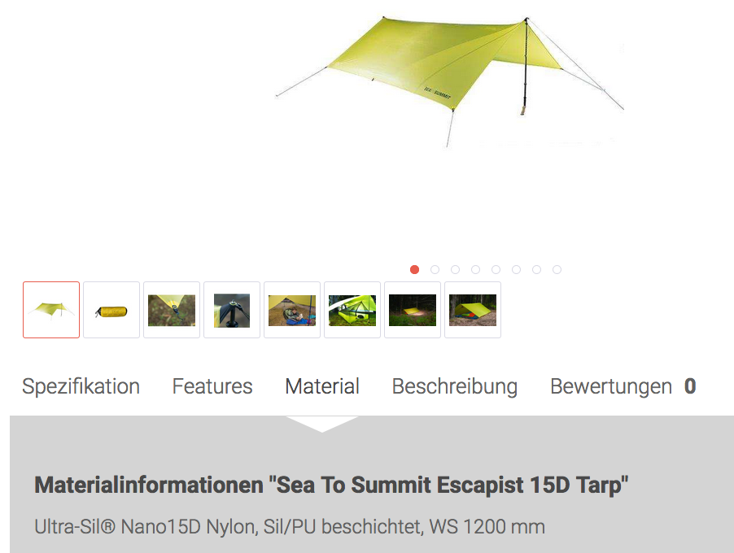
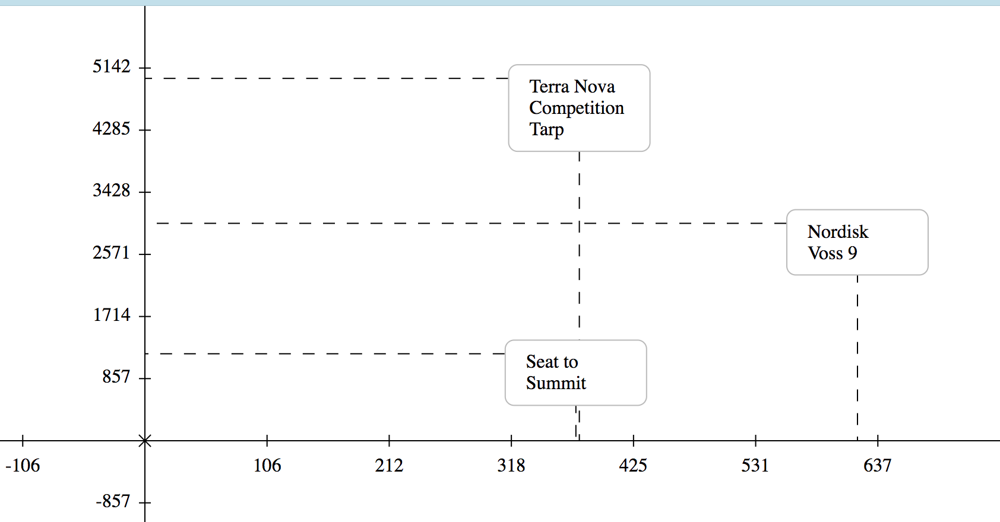

# Shackleton
https://chillkroetetts.github.io/shackleton/

Simple client based tool to compare key figures from e.g. articles.
Build entirely in Clojurescript with Reagent+Reframe.
Named after the famous polar explorer Sir Ernest Henry Shackleton.

## But why?
I was planning a hiking trip to sweden while I was searching for a good tarp as raincover.
While browsing different products I quickly lost track about which tarp was how waterproof and still ligthweight. Shackleton aims to solve this by letting the user choose which key figures he want to
compare in a simple coordinate system.

And of course I needed a project I could do to get in touch with Clojurescript.

